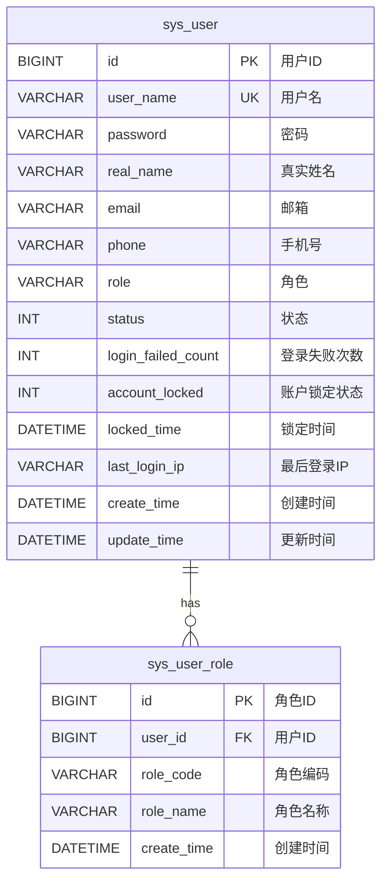
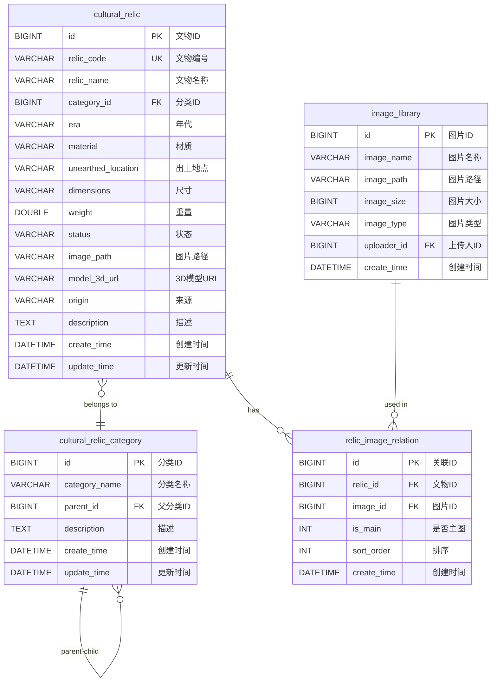
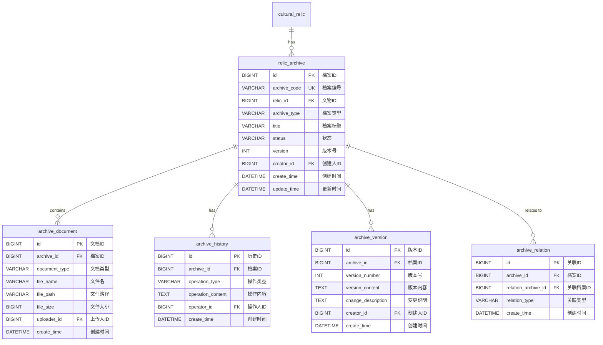
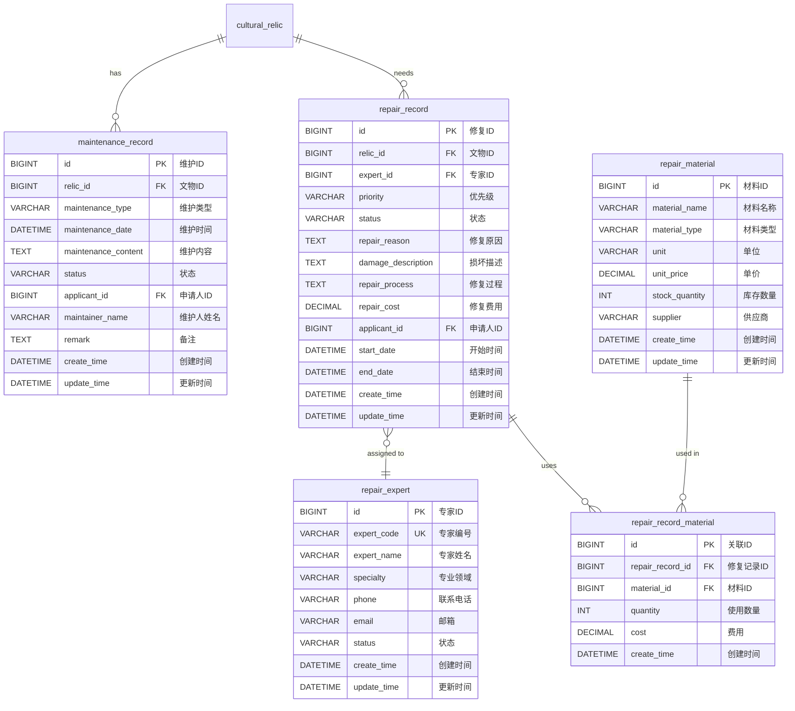
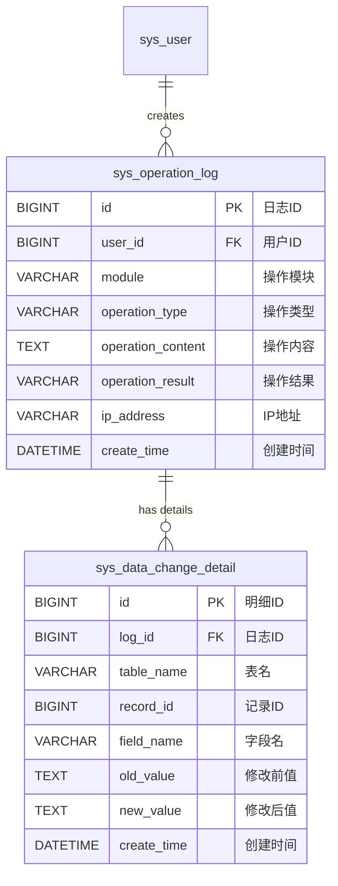
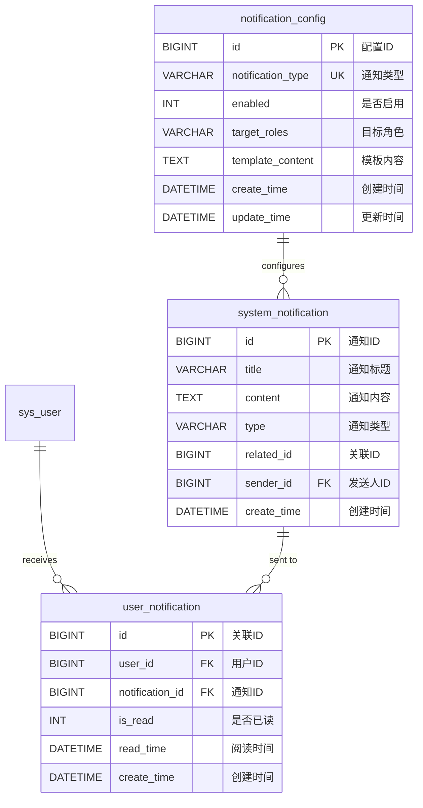
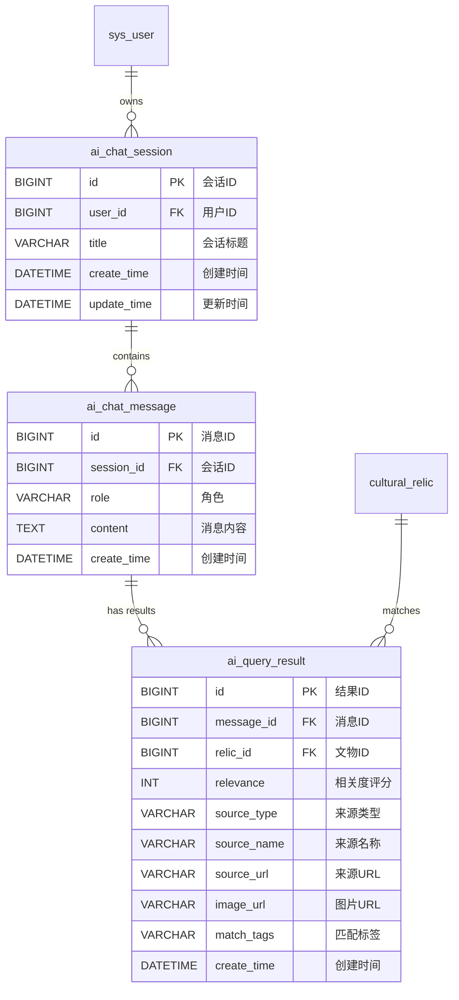
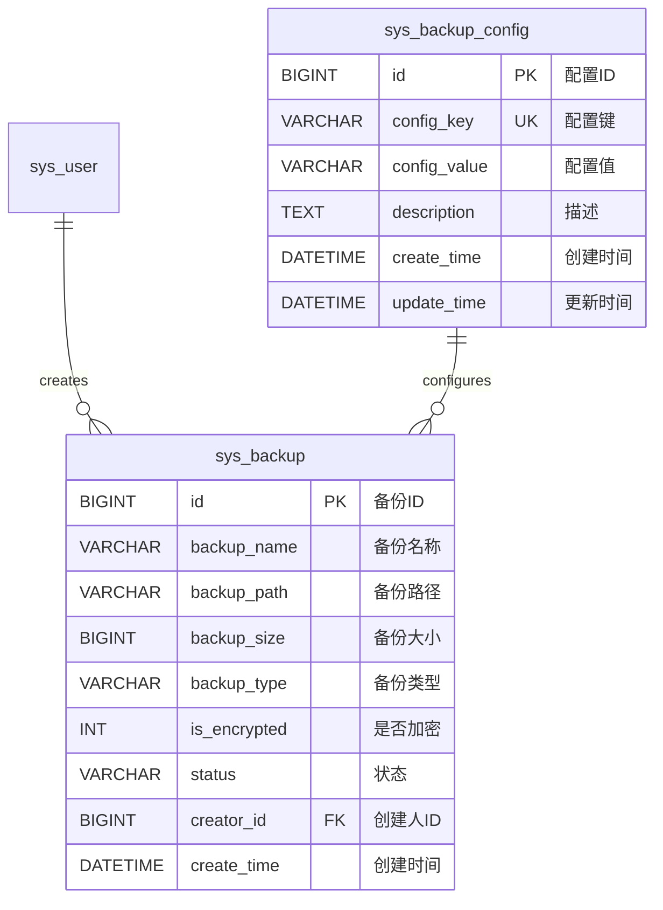

# 博物馆文物数字化管理系统 - 数据库ER图

## 完整ER图

```mermaid
erDiagram
    %% 用户相关表
    sys_user ||--o{ sys_user_role : "has"
    sys_user ||--o{ sys_operation_log : "creates"
    sys_user ||--o{ user_notification : "receives"
    sys_user ||--o{ ai_chat_session : "owns"
    sys_user ||--o{ relic_archive : "creates"
    sys_user ||--o{ archive_document : "uploads"
    sys_user ||--o{ archive_history : "operates"
    sys_user ||--o{ maintenance_record : "applies"
    sys_user ||--o{ repair_record : "applies"
    sys_user ||--o{ sys_backup : "creates"
    sys_user ||--o{ image_library : "uploads"
    
    %% 文物相关表
    cultural_relic ||--o{ relic_image_relation : "has"
    cultural_relic ||--o{ relic_archive : "has"
    cultural_relic ||--o{ maintenance_record : "has"
    cultural_relic ||--o{ repair_record : "needs"
    cultural_relic }o--|| cultural_relic_category : "belongs to"
    cultural_relic ||--o{ ai_query_result : "matches"
    
    %% 分类表
    cultural_relic_category ||--o{ cultural_relic_category : "parent-child"
    
    %% 图片相关表
    image_library ||--o{ relic_image_relation : "used in"
    
    %% 档案相关表
    relic_archive ||--o{ archive_document : "contains"
    relic_archive ||--o{ archive_history : "has"
    relic_archive ||--o{ archive_version : "has"
    relic_archive ||--o{ archive_relation : "relates to"
    relic_archive ||--o{ archive_relation : "related by"
    
    %% 修复相关表
    repair_record }o--|| repair_expert : "assigned to"
    repair_record ||--o{ repair_record_material : "uses"
    repair_material ||--o{ repair_record_material : "used in"
    
    %% 日志相关表
    sys_operation_log ||--o{ sys_data_change_detail : "has details"
    
    %% 通知相关表
    system_notification ||--o{ user_notification : "sent to"
    notification_config ||--o{ system_notification : "configures"
    
    %% AI对话相关表
    ai_chat_session ||--o{ ai_chat_message : "contains"
    ai_chat_message ||--o{ ai_query_result : "has results"
    
    %% 备份相关表
    sys_backup_config ||--o{ sys_backup : "configures"

    %% 表定义
    sys_user {
        BIGINT id PK
        VARCHAR user_name UK
        VARCHAR password
        VARCHAR real_name
        VARCHAR email
        VARCHAR phone
        VARCHAR role
        INT status
        INT login_failed_count
        INT account_locked
        DATETIME locked_time
        VARCHAR last_login_ip
        DATETIME create_time
        DATETIME update_time
    }
    
    sys_user_role {
        BIGINT id PK
        BIGINT user_id FK
        VARCHAR role_code
        VARCHAR role_name
        DATETIME create_time
    }
    
    cultural_relic {
        BIGINT id PK
        VARCHAR relic_code UK
        VARCHAR relic_name
        BIGINT category_id FK
        VARCHAR era
        VARCHAR material
        VARCHAR unearthed_location
        VARCHAR dimensions
        DOUBLE weight
        VARCHAR status
        VARCHAR image_path
        VARCHAR model_3d_url
        VARCHAR origin
        TEXT description
        DATETIME create_time
        DATETIME update_time
    }
    
    cultural_relic_category {
        BIGINT id PK
        VARCHAR category_name
        BIGINT parent_id FK
        TEXT description
        DATETIME create_time
        DATETIME update_time
    }
    
    image_library {
        BIGINT id PK
        VARCHAR image_name
        VARCHAR image_path
        BIGINT image_size
        VARCHAR image_type
        BIGINT uploader_id FK
        DATETIME create_time
    }
    
    relic_image_relation {
        BIGINT id PK
        BIGINT relic_id FK
        BIGINT image_id FK
        INT is_main
        INT sort_order
        DATETIME create_time
    }
    
    relic_archive {
        BIGINT id PK
        VARCHAR archive_code UK
        BIGINT relic_id FK
        VARCHAR archive_type
        VARCHAR title
        VARCHAR status
        INT version
        BIGINT creator_id FK
        DATETIME create_time
        DATETIME update_time
    }
    
    archive_document {
        BIGINT id PK
        BIGINT archive_id FK
        VARCHAR document_type
        VARCHAR file_name
        VARCHAR file_path
        BIGINT file_size
        BIGINT uploader_id FK
        DATETIME create_time
    }
    
    archive_history {
        BIGINT id PK
        BIGINT archive_id FK
        VARCHAR operation_type
        TEXT operation_content
        BIGINT operator_id FK
        DATETIME create_time
    }
    
    archive_version {
        BIGINT id PK
        BIGINT archive_id FK
        INT version_number
        TEXT version_content
        TEXT change_description
        BIGINT creator_id FK
        DATETIME create_time
    }
    
    archive_relation {
        BIGINT id PK
        BIGINT archive_id FK
        BIGINT relation_archive_id FK
        VARCHAR relation_type
        DATETIME create_time
    }
    
    maintenance_record {
        BIGINT id PK
        BIGINT relic_id FK
        VARCHAR maintenance_type
        DATETIME maintenance_date
        TEXT maintenance_content
        VARCHAR status
        BIGINT applicant_id FK
        VARCHAR maintainer_name
        TEXT remark
        DATETIME create_time
        DATETIME update_time
    }
    
    repair_record {
        BIGINT id PK
        BIGINT relic_id FK
        BIGINT expert_id FK
        VARCHAR priority
        VARCHAR status
        TEXT repair_reason
        TEXT damage_description
        TEXT repair_process
        DECIMAL repair_cost
        BIGINT applicant_id FK
        DATETIME start_date
        DATETIME end_date
        DATETIME create_time
        DATETIME update_time
    }
    
    repair_expert {
        BIGINT id PK
        VARCHAR expert_code UK
        VARCHAR expert_name
        VARCHAR specialty
        VARCHAR phone
        VARCHAR email
        VARCHAR status
        DATETIME create_time
        DATETIME update_time
    }
    
    repair_material {
        BIGINT id PK
        VARCHAR material_name
        VARCHAR material_type
        VARCHAR unit
        DECIMAL unit_price
        INT stock_quantity
        VARCHAR supplier
        DATETIME create_time
        DATETIME update_time
    }
    
    repair_record_material {
        BIGINT id PK
        BIGINT repair_record_id FK
        BIGINT material_id FK
        INT quantity
        DECIMAL cost
        DATETIME create_time
    }
    
    sys_operation_log {
        BIGINT id PK
        BIGINT user_id FK
        VARCHAR module
        VARCHAR operation_type
        TEXT operation_content
        VARCHAR operation_result
        VARCHAR ip_address
        DATETIME create_time
    }
    
    sys_data_change_detail {
        BIGINT id PK
        BIGINT log_id FK
        VARCHAR table_name
        BIGINT record_id
        VARCHAR field_name
        TEXT old_value
        TEXT new_value
        DATETIME create_time
    }
    
    system_notification {
        BIGINT id PK
        VARCHAR title
        TEXT content
        VARCHAR type
        BIGINT related_id
        BIGINT sender_id FK
        DATETIME create_time
    }
    
    notification_config {
        BIGINT id PK
        VARCHAR notification_type UK
        INT enabled
        VARCHAR target_roles
        TEXT template_content
        DATETIME create_time
        DATETIME update_time
    }
    
    user_notification {
        BIGINT id PK
        BIGINT user_id FK
        BIGINT notification_id FK
        INT is_read
        DATETIME read_time
        DATETIME create_time
    }
    
    ai_chat_session {
        BIGINT id PK
        BIGINT user_id FK
        VARCHAR title
        DATETIME create_time
        DATETIME update_time
    }
    
    ai_chat_message {
        BIGINT id PK
        BIGINT session_id FK
        VARCHAR role
        TEXT content
        DATETIME create_time
    }
    
    ai_query_result {
        BIGINT id PK
        BIGINT message_id FK
        BIGINT relic_id FK
        INT relevance
        VARCHAR source_type
        VARCHAR source_name
        VARCHAR source_url
        VARCHAR image_url
        VARCHAR match_tags
        DATETIME create_time
    }
    
    sys_backup {
        BIGINT id PK
        VARCHAR backup_name
        VARCHAR backup_path
        BIGINT backup_size
        VARCHAR backup_type
        INT is_encrypted
        VARCHAR status
        BIGINT creator_id FK
        DATETIME create_time
    }
    
    sys_backup_config {
        BIGINT id PK
        VARCHAR config_key UK
        VARCHAR config_value
        TEXT description
        DATETIME create_time
        DATETIME update_time
    }
```

## 分模块ER图

### 1. 用户管理模块

### 2. 文物管理模块

### 3. 档案管理模块

### 4. 维护与修复模块

### 5. 日志与审计模块

### 6. 通知模块

### 7. AI对话模块

### 8. 数据备份模块

## 数据库关系说明

### 核心关系

1. **用户中心关系**
   - 一个用户可以有多个角色(sys_user → sys_user_role)
   - 一个用户可以创建多条操作日志(sys_user → sys_operation_log)
   - 一个用户可以接收多条通知(sys_user → user_notification)
   - 一个用户可以拥有多个AI会话(sys_user → ai_chat_session)

2. **文物中心关系**
   - 一个文物属于一个分类(cultural_relic → cultural_relic_category)
   - 一个文物可以有多张图片(cultural_relic → relic_image_relation → image_library)
   - 一个文物可以有多个档案(cultural_relic → relic_archive)
   - 一个文物可以有多条维护记录(cultural_relic → maintenance_record)
   - 一个文物可以有多条修复记录(cultural_relic → repair_record)

3. **档案管理关系**
   - 一个档案可以包含多个文档(relic_archive → archive_document)
   - 一个档案可以有多条操作历史(relic_archive → archive_history)
   - 一个档案可以有多个版本(relic_archive → archive_version)
   - 档案之间可以建立关联关系(relic_archive → archive_relation)

4. **修复管理关系**
   - 一条修复记录分配给一个专家(repair_record → repair_expert)
   - 一条修复记录可以使用多种材料(repair_record → repair_record_material → repair_material)

5. **AI对话关系**
   - 一个会话包含多条消息(ai_chat_session → ai_chat_message)
   - 一条消息可以有多个查询结果(ai_chat_message → ai_query_result)
   - 查询结果可以关联文物(ai_query_result → cultural_relic)

### 关系基数

- **一对一(1:1)**: 无
- **一对多(1:N)**: 大部分关系,如用户-日志、文物-图片、档案-文档等
- **多对多(M:N)**: 通过中间表实现
  - 文物-图片(通过relic_image_relation)
  - 修复记录-材料(通过repair_record_material)
  - 用户-通知(通过user_notification)

### 外键约束

所有标注FK的字段都建立了外键约束,保证数据的参照完整性。主要外键包括:
- user_id → sys_user(id)
- relic_id → cultural_relic(id)
- category_id → cultural_relic_category(id)
- archive_id → relic_archive(id)
- expert_id → repair_expert(id)
- session_id → ai_chat_session(id)

### 唯一性约束

以下字段具有唯一性约束(UK):
- sys_user.user_name
- cultural_relic.relic_code
- relic_archive.archive_code
- repair_expert.expert_code
- notification_config.notification_type
- sys_backup_config.config_key
